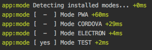

 &nbsp;&nbsp;&nbsp;&nbsp;&nbsp; 


# **`@quasar/test`** 
is the monorepo for integrating the test-runner of your choice into your Quasar-Framework app. For more information and current status, please refer to the following RFC's:

- [\[RFC\] Add --mode test to quasar-cli](https://github.com/quasarframework/quasar-cli/issues/127)
- [\[RFC\] Add test runners to project during quasar init](https://github.com/quasarframework/quasar-starter-kit/issues/43)

## Contents

The packages in this repo are designed to be installed only by the Quasar framework. They follow the following naming convention: 

 - @quasar/test-base
 - @quasar/test-unit-* 
 - @quasar/test-e2e-* 
 - @quasar/test-quality-*

Where for example the `ava` test-runner would be `@quasar/test-unit-ava`. 


> Although you could probably install them all with yarn, it is highly recommended that you install them "properly" with the quasar cli. If you are interested in breaking the warranty, if you were only interested in integrating ava and spectron into your app, technically you could merely run: 

```bash
$ yarn add @quasar/test-base 
$ yarn add @quasar/test-unit-ava
$ yarn add @quasar/test-spectron
```


## Integration Roadmap
Test runners currently verified to have valid "integration" are checked off in the following list:

### BASE
- [x] [@vue/test-utils](https://vue-test-utils.vuejs.org)
- [x] [@vue/test-server-utils](https://github.com/vuejs/vue-test-utils/tree/dev/packages/server-test-utils)
- [x] [istanbul](https://istanbul.js.org/)
- [x] [nyc](https://github.com/istanbuljs/nyc)
- [x] [chai](http://www.chaijs.com/)
- [x] [sinon](http://sinonjs.org/)

### UNIT
- [x] [ava](https://github.com/avajs/ava)
- [x] [jest23](https://facebook.github.io/jest/)
- [x] [mocha](https://mochajs.org)
- [ ] [mocha-loader](https://github.com/webpack-contrib/mocha-loader) (for webpack) 
- [ ] [mocha-webpack](https://github.com/zinserjan/mocha-webpack)
- [ ] [jasmine](https://jasmine.github.io/)
- [ ] [tap](https://github.com/tapjs/node-tap)
- [ ] [tape](https://github.com/substack/tape)

### E2E
- [ ] [appium](https://github.com/appium/appium) (cordova)
- [x] [cypress](https://github.com/cypress-io/cypress)
- [ ] [karma](https://github.com/karma-runner/karma)
- [ ] [nightwatch](http://nightwatchjs.org/)
- [ ] [spectron](https://github.com/electron/spectron) (electron)

### QUALITY
- [x] [lighthouse 3.0](https://github.com/GoogleChrome/lighthouse)
- [ ] [import-cost](https://github.com/wix/import-cost/tree/master/packages/import-cost)
- [ ] [bundlesize](https://github.com/siddharthkp/bundlesize)


## Contributing
Contributions to this repository are highly desirable. Before you make a PR, please open an issue, create a fork and PR. See the [Contribution Guidelines](./.github/CONTRIBUTING.md) for more details. Please note: Project coordination takes place on the [Discord server](https://discord.gg/5TDhbDg). 
